# Entity-Relationship Diagram

```mermaid
erDiagram
    Customer {
        int Id PK
        string FullName "nvarchar(100)"
        string Email "nvarchar(200), UNIQUE"
        string PhoneNumber "nvarchar(13)"
        datetime CreatedAt
    }

    Subscription {
        int Id PK
        int CustomerId FK
        int SubscriptionType "0=Electricity 1=Water 2=Internet 3=GSM 4=NaturalGas"
        string ProviderName "nvarchar(100)"
        string SubscriptionNumber "nvarchar(50)"
        int Status "0=Active 1=Passive"
        int BillingDayOfMonth "1-21, provider-owned"
        int LastPaymentDayOfMonth "= BillingDayOfMonth + 7, provider-owned"
        int PaymentDayOfMonth "customer-owned, in [Billing, LastPayment]"
        bit IsAutoPay "customer-owned"
        datetime CreatedAt
    }

    Payment {
        int Id PK
        int SubscriptionId FK
        decimal Amount "decimal(18,2)"
        datetime PaymentDate
        string Period "nvarchar(7), format YYYY-MM"
        int Status "0=Successful 1=Failed"
        string ExternalTransactionId "nvarchar(100), nullable"
    }

    User {
        int Id PK
        string Email "nvarchar(200), UNIQUE"
        string PasswordHash "PBKDF2-SHA256 + 16-byte salt, 350k iterations"
        string Role "nvarchar(20) — 'Admin' or 'Customer'"
        int CustomerId FK "nullable — Admin has no Customer"
        datetime CreatedAt
    }

    Notification {
        int Id PK
        string Channel "nvarchar(20) — 'SMS' or 'EMAIL'"
        string Recipient "nvarchar(200) — phone or email"
        string Message "nvarchar(max)"
        datetime SentAt "indexed for newest-first queries"
    }

    Customer ||--o{ Subscription : "has"
    Subscription ||--o{ Payment : "has"
    Customer ||--o| User : "may have a login"
```

## Cardinality and design notes

**Customer → Subscription (one-to-many)**
A customer may have zero or many subscriptions. Subscriptions cannot exist without a customer — `CustomerId` is non-nullable with `CASCADE DELETE`. Removing a customer removes all their subscriptions.

**Subscription → Payment (one-to-many)**
A subscription accumulates one payment record per billing period. Failed attempts are also recorded (no filtered delete), creating a complete audit trail. `SubscriptionId` is non-nullable with `CASCADE DELETE`.

**Customer → User (one-to-one, optional)**
A customer may have a `User` for login (current rule: at most one). The `User.CustomerId` foreign key is **nullable** so the bank-side **Admin** account exists without a Customer row. `CASCADE DELETE` from Customer removes the linked User; deleting a User leaves the Customer untouched.

**Compound unique index on Payment**
`(SubscriptionId, Period) WHERE [Status] = 0` — the filtered index allows multiple Failed records for the same period (retries are permitted) while preventing two Successful payments for the same `(SubscriptionId, Period)`. The service layer adds a pre-check for a friendlier error message; the index is the ultimate safety net against races.

**`PaymentStatus.Successful = 0` is load-bearing**
The filtered index is defined as `WHERE [Status] = 0`. This integer value must never change. Documented with an inline comment in `PaymentStatus.cs`.

**Notification is a write-only log**
The `Notifications` table is append-only audit data for the mock SMS/Email channel. No foreign keys — the recipient is matched back to a `Customer` by phone/email **at read time** in `NotificationsController` so deleting a customer does not destroy their notification history.

**No soft-delete**
Entities are hard-deleted. Cascade ensures referential integrity without orphan records.

## Provider-owned vs customer-owned fields on Subscription

| Field | Owner | Mutable? | Source |
|---|---|---|---|
| `BillingDayOfMonth` | Provider | No (after create) | `IProviderInfoClient.GetProviderInfoAsync(...)` |
| `LastPaymentDayOfMonth` | Provider | No (after create) | `BillingDayOfMonth + 7`, returned by the same mock |
| `PaymentDayOfMonth` | Customer | Yes, must satisfy `BillingDayOfMonth ≤ value ≤ LastPaymentDayOfMonth` | `PUT /api/users/me/subscriptions/{id}` |
| `IsAutoPay` | Customer | Yes | same |

Out-of-range payment days are rejected with `409 PAYMENT_DAY_OUT_OF_RANGE` in `SubscriptionService.UpdateAsync`.
