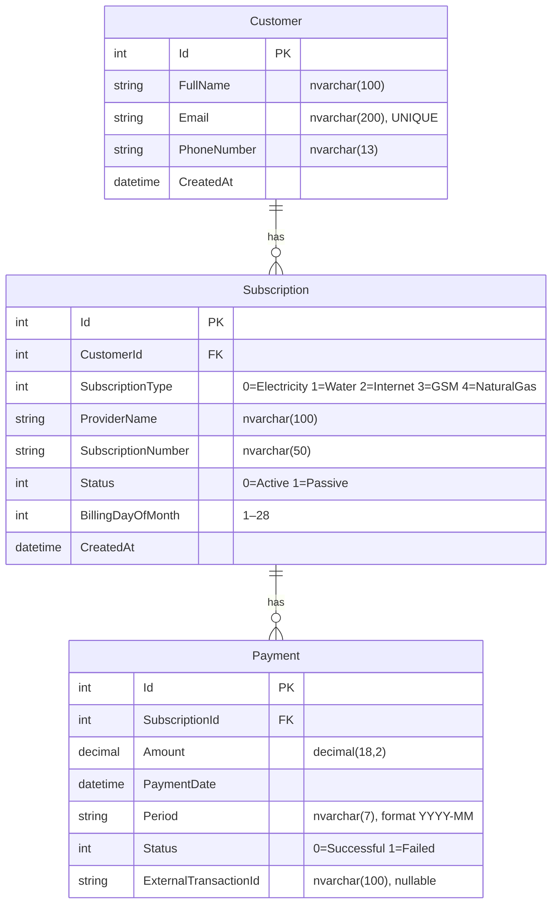

# Entity-Relationship Diagram

## Cardinality and design notes

**Customer → Subscription (one-to-many)**
A customer may have zero or many subscriptions. Subscriptions cannot exist without a customer — `CustomerId` is a non-nullable foreign key with `CASCADE DELETE`, so removing a customer automatically removes all their subscriptions.

**Subscription → Payment (one-to-many)**
A subscription accumulates one payment record per billing period. Failed attempts are also recorded (no filtered delete), creating a complete audit trail. `SubscriptionId` is non-nullable with `CASCADE DELETE`.

**Compound unique index on Payment**
`(SubscriptionId, Period) WHERE [Status] = 0` — the filtered index allows multiple Failed records for the same period (retries are permitted) while preventing two Successful payments for the same subscription and period. This is the ultimate database-level safety net; the service layer adds a pre-check for a friendlier error message.

**`PaymentStatus.Successful = 0` is load-bearing**
The filtered index is defined as `WHERE [Status] = 0`. This integer value must never change. It is documented with an inline comment in `PaymentStatus.cs`.

**No soft-delete**
Entities are hard-deleted. Cascade ensures referential integrity without orphan records.
