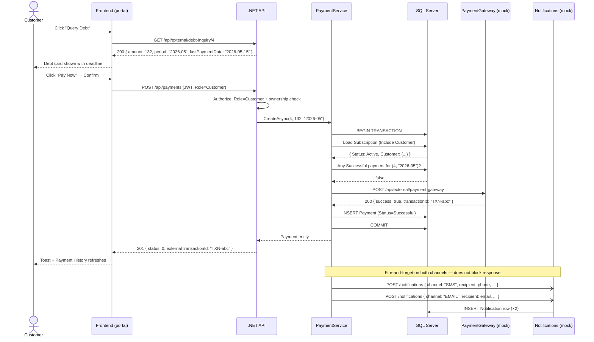
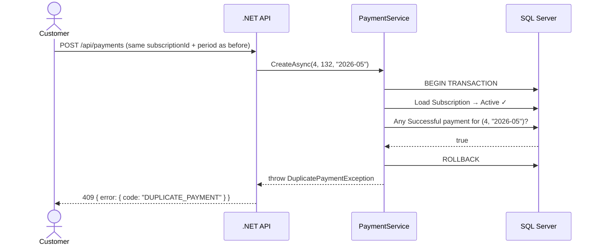
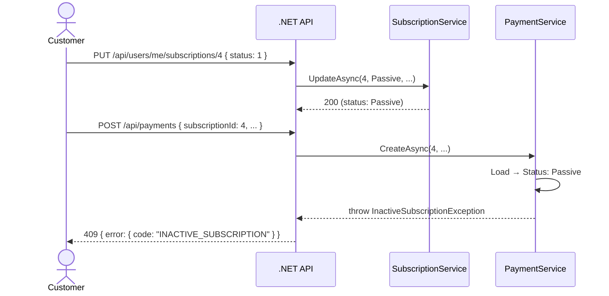
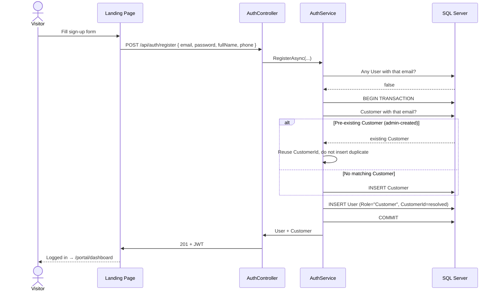
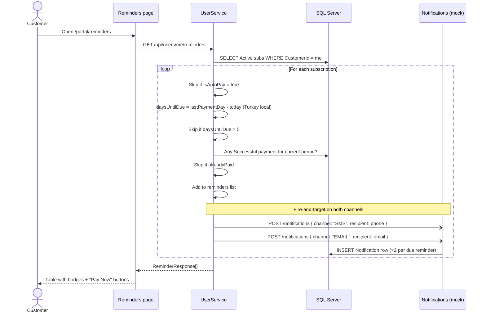
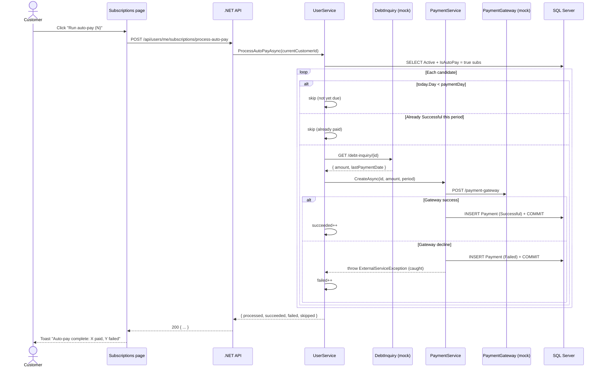

# Flow Diagrams

## 1. Happy Path — Debt Inquiry → Payment → Notification



---

## 2. Duplicate Payment Rejection



---

## 3. Passive Subscription Rejection



---

## 4. Payment Gateway Failure

```mermaid
sequenceDiagram
    actor User as Customer
    participant API as .NET API
    participant PS as PaymentService
    participant DB as SQL Server
    participant GW as PaymentGateway (mock)

    User->>API: POST /api/payments
    API->>PS: CreateAsync(4, 132, "2026-07")
    PS->>DB: BEGIN TRANSACTION
    PS->>DB: Load → Active ✓ ; no duplicate
    PS->>GW: POST /api/external/payment-gateway
    GW-->>PS: 400 { success: false, errorCode: "INSUFFICIENT_FUNDS" }
    PS->>DB: INSERT Payment (Status=Failed)
    PS->>DB: COMMIT  (audit record preserved)
    PS-->>API: throw ExternalServiceException("INSUFFICIENT_FUNDS")
    API-->>User: 502 { error: { code: "INSUFFICIENT_FUNDS" } }
    Note over DB: Failed payment row stays — visible in Payment History
```

---

## 5. Sign-up Linking to an Admin-Pre-Created Customer



---

## 6. Reminder Fetch — SMS + Email Fan-Out



---

## 7. Auto-Pay Batch — `process-auto-pay`


