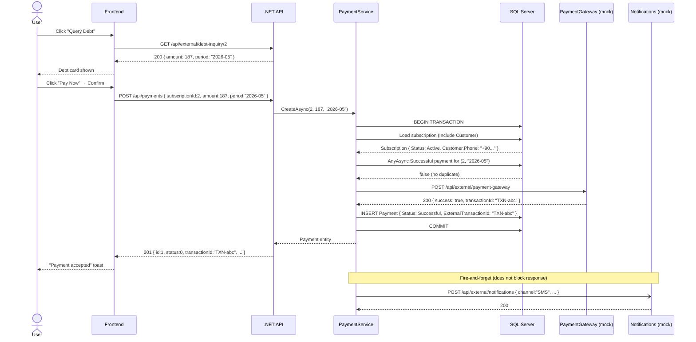
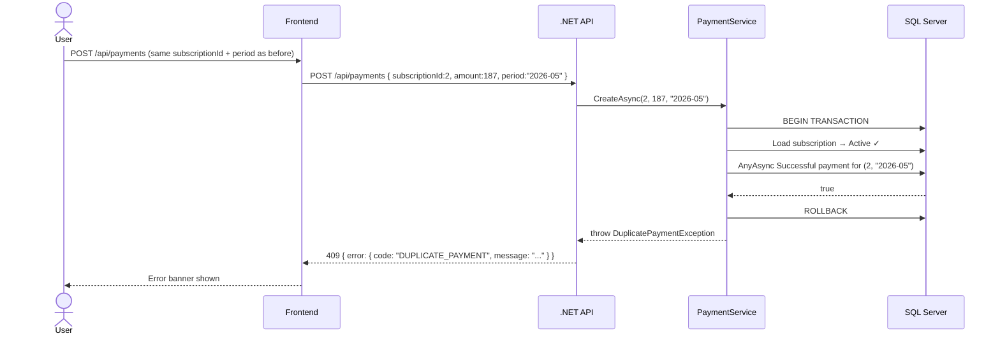
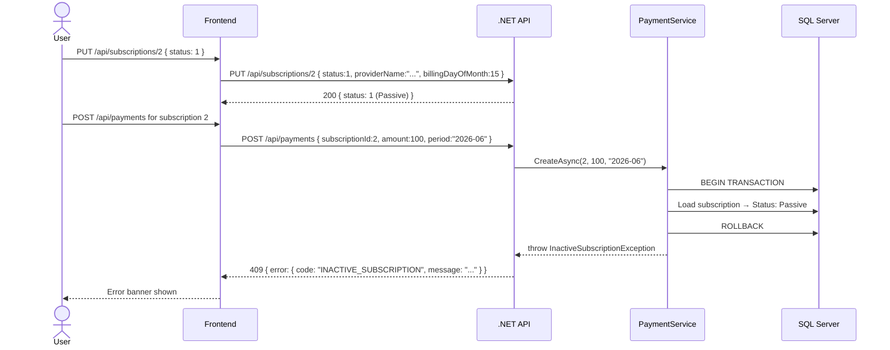
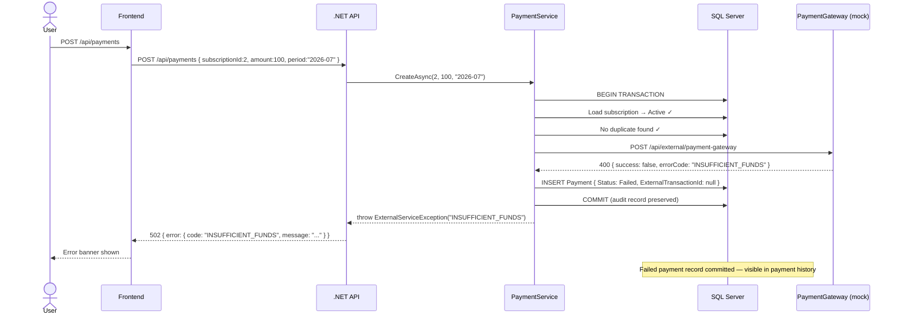

# Flow Diagrams

## 1. Happy Path — Debt Inquiry → Payment → Notification

```mermaid
sequenceDiagram
    actor User
    participant Frontend
    participant API as .NET API
    participant PaymentService
    participant DB as SQL Server
    participant Gateway as PaymentGateway (mock)
    participant Notify as Notifications (mock)

    User->>Frontend: Click "Query Debt"
    Frontend->>API: GET /api/external/debt-inquiry/2
    API-->>Frontend: 200 { amount: 187, period: "2026-05" }
    Frontend-->>User: Debt card shown

    User->>Frontend: Click "Pay Now" → Confirm
    Frontend->>API: POST /api/payments { subscriptionId:2, amount:187, period:"2026-05" }
    API->>PaymentService: CreateAsync(2, 187, "2026-05")
    PaymentService->>DB: BEGIN TRANSACTION
    PaymentService->>DB: Load subscription (Include Customer)
    DB-->>PaymentService: Subscription { Status: Active, Customer.Phone: "+90..." }
    PaymentService->>DB: AnyAsync Successful payment for (2, "2026-05")
    DB-->>PaymentService: false (no duplicate)
    PaymentService->>Gateway: POST /api/external/payment-gateway
    Gateway-->>PaymentService: 200 { success: true, transactionId: "TXN-abc" }
    PaymentService->>DB: INSERT Payment { Status: Successful, ExternalTransactionId: "TXN-abc" }
    PaymentService->>DB: COMMIT
    PaymentService-->>API: Payment entity
    API-->>Frontend: 201 { id:1, status:0, transactionId:"TXN-abc", ... }
    Frontend-->>User: "Payment accepted" toast

    Note over PaymentService,Notify: Fire-and-forget (does not block response)
    PaymentService-)Notify: POST /api/external/notifications { channel:"SMS", ... }
    Notify-->>PaymentService: 200
```

---

## 2. Duplicate Payment Rejection

```mermaid
sequenceDiagram
    actor User
    participant Frontend
    participant API as .NET API
    participant PaymentService
    participant DB as SQL Server

    User->>Frontend: POST /api/payments (same subscriptionId + period as before)
    Frontend->>API: POST /api/payments { subscriptionId:2, amount:187, period:"2026-05" }
    API->>PaymentService: CreateAsync(2, 187, "2026-05")
    PaymentService->>DB: BEGIN TRANSACTION
    PaymentService->>DB: Load subscription → Active ✓
    PaymentService->>DB: AnyAsync Successful payment for (2, "2026-05")
    DB-->>PaymentService: true
    PaymentService->>DB: ROLLBACK
    PaymentService-->>API: throw DuplicatePaymentException
    API-->>Frontend: 409 { error: { code: "DUPLICATE_PAYMENT", message: "..." } }
    Frontend-->>User: Error banner shown
```

---

## 3. Passive Subscription Rejection

```mermaid
sequenceDiagram
    actor User
    participant Frontend
    participant API as .NET API
    participant PaymentService
    participant DB as SQL Server

    User->>Frontend: PUT /api/subscriptions/2 { status: 1 }
    Frontend->>API: PUT /api/subscriptions/2 { status:1, providerName:"...", billingDayOfMonth:15 }
    API-->>Frontend: 200 { status: 1 (Passive) }

    User->>Frontend: POST /api/payments for subscription 2
    Frontend->>API: POST /api/payments { subscriptionId:2, amount:100, period:"2026-06" }
    API->>PaymentService: CreateAsync(2, 100, "2026-06")
    PaymentService->>DB: BEGIN TRANSACTION
    PaymentService->>DB: Load subscription → Status: Passive
    PaymentService->>DB: ROLLBACK
    PaymentService-->>API: throw InactiveSubscriptionException
    API-->>Frontend: 409 { error: { code: "INACTIVE_SUBSCRIPTION", message: "..." } }
    Frontend-->>User: Error banner shown
```

---

## 4. Payment Gateway Failure

```mermaid
sequenceDiagram
    actor User
    participant Frontend
    participant API as .NET API
    participant PaymentService
    participant DB as SQL Server
    participant Gateway as PaymentGateway (mock)

    User->>Frontend: POST /api/payments
    Frontend->>API: POST /api/payments { subscriptionId:2, amount:100, period:"2026-07" }
    API->>PaymentService: CreateAsync(2, 100, "2026-07")
    PaymentService->>DB: BEGIN TRANSACTION
    PaymentService->>DB: Load subscription → Active ✓
    PaymentService->>DB: No duplicate found ✓
    PaymentService->>Gateway: POST /api/external/payment-gateway
    Gateway-->>PaymentService: 400 { success: false, errorCode: "INSUFFICIENT_FUNDS" }
    PaymentService->>DB: INSERT Payment { Status: Failed, ExternalTransactionId: null }
    PaymentService->>DB: COMMIT (audit record preserved)
    PaymentService-->>API: throw ExternalServiceException("INSUFFICIENT_FUNDS")
    API-->>Frontend: 502 { error: { code: "INSUFFICIENT_FUNDS", message: "..." } }
    Frontend-->>User: Error banner shown

    Note over DB: Failed payment record committed — visible in payment history
```
